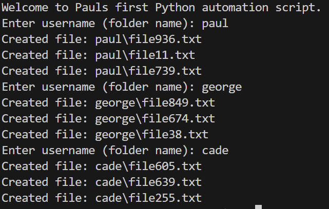

# This python script automates creating user folders and files and uses if _ _ name _ _ == "_ _ main _ _" so it only runs when executed directly and can be safely reused in other automation scripts.

